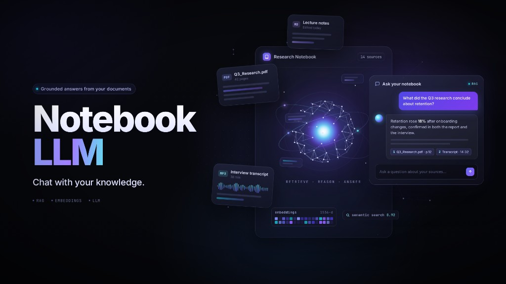

# Notebook LLM



**Chat with your knowledge.** Grounded answers from your documents using RAG, embeddings, and LLMs.

## Project structure

- `client/` — Next.js frontend
- `server/` — Express + TypeScript API (Prisma, Pinecone, Inngest, OpenAI)
- `docker-compose.yml` — Postgres (pgvector) for local development

## Getting started

```bash
# Start Postgres
docker compose up -d

# Server
cd server
npm install
npm run dev

# Client (in another terminal)
cd client
npm install
npm run dev
```
